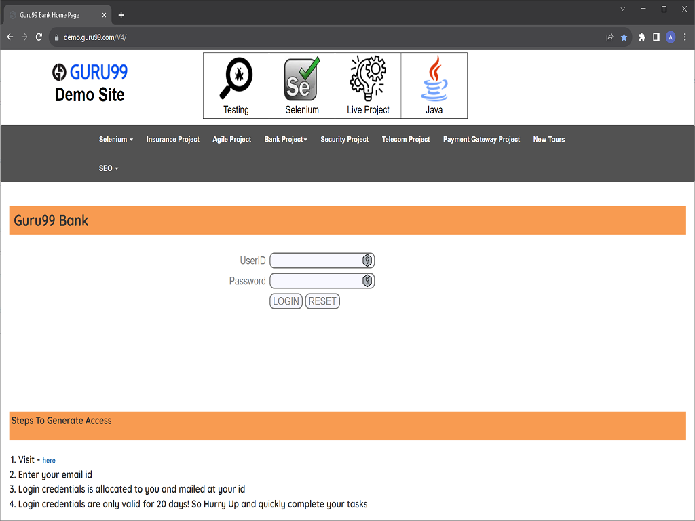
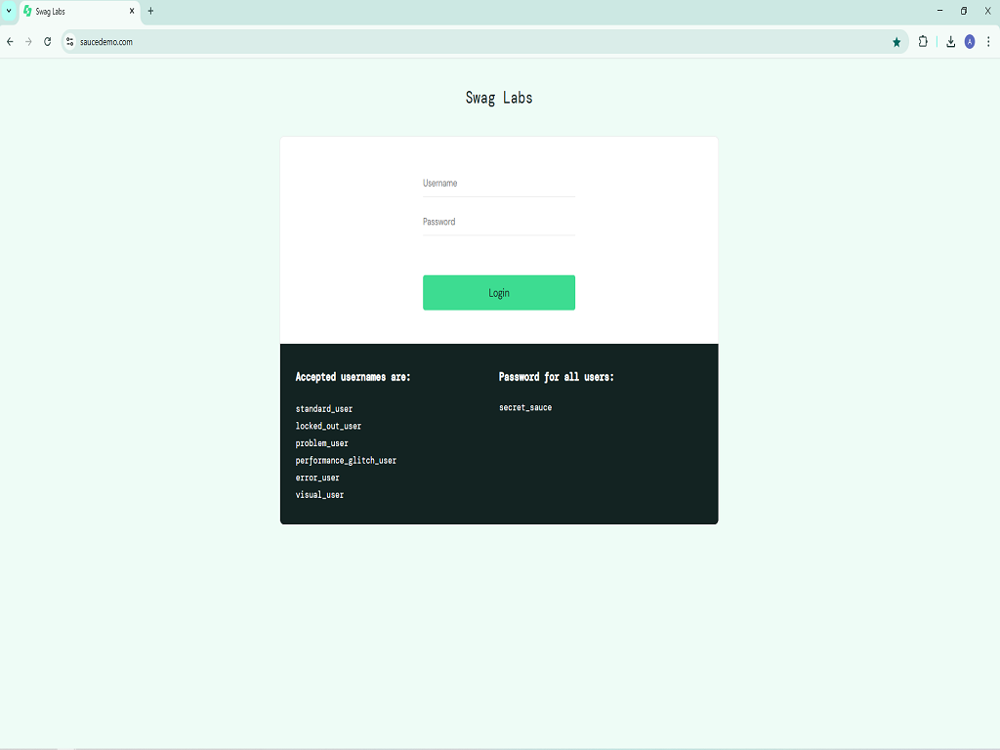
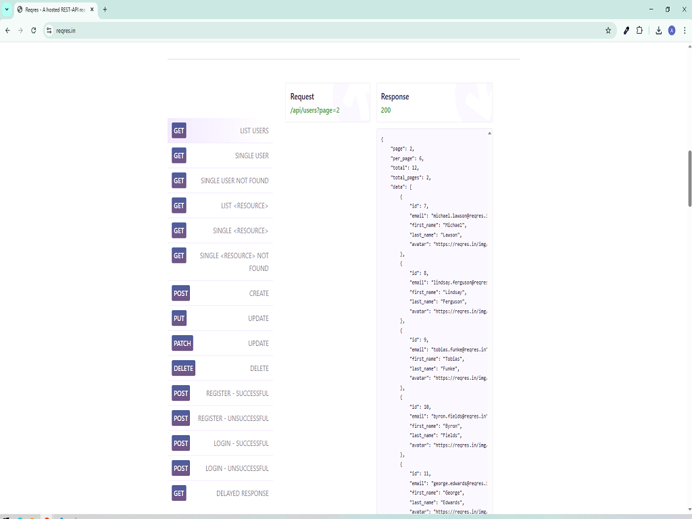
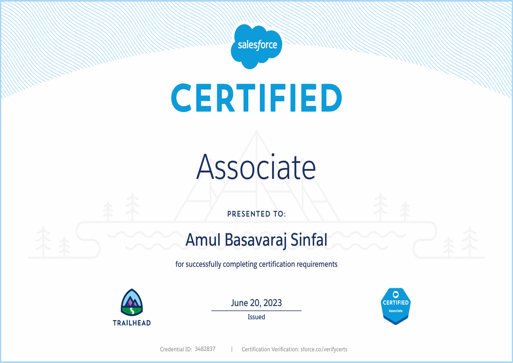
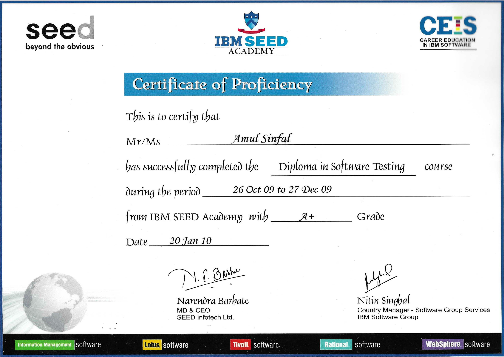

## 👋 About Me

I have strong expertise in **manual testing** and over 1 year of experience in **automation testing** with Selenium WebDriver, and API testing using Postman. My experience includes working with **Agile methodologies**, collaborating with cross-functional teams to ensure software quality by identifying defects, validating functionality, and contributing to test planning for seamless software delivery.

As an aspiring automation tester, I have created projects to demonstrate my skills in **Core Java**, **Selenium WebDriver**, **TestNG**, and **Postman**, which I have uploaded on **GitHub** . I am continuously enhancing my skills by working on automation projects, exploring advanced test frameworks, and staying updated with modern testing tools. I am passionate about improving test efficiency through automation and actively expanding my knowledge to keep up with evolving industry trends.

I hold industry-recognized certifications, including the **Agile Tester Foundation Extension Certificate in Software Testing** and the **Foundation Level Certificate in Software Testing**. These certifications validate my expertise in software testing principles, Agile methodologies, and structured testing approaches.

My objective is to secure a role in an organization where I can grow as an automation tester while also contributing my expertise in manual testing. I aim to contribute to a team that prioritizes software quality, and values continuous learning to deliver robust and reliable software solutions.

 

## 💡 WHAT I KNOW ?

|    |    |    |    |
|     :---:              |     :---:              |     :---:              |     :---:              |
| **Manual Testing** |  **Automation Testing** | **API Testing** | **Test Documentation** |

 

## ⚙️ SKILLSET
  
||||||
|:---:|:---:|:---:|:---:|:---:|
|Jira |Agile|Postman|Selenium|Java|
||||| |
|TestNG|Eclipse|Git|Github| |

 

## ⭐ PROJECTS

|**Project 01 :- Hybrid Test Automation Framework for Guru99 Bank Using Selenium & Java.**|
|:---:|
||
||
|This project demonstrates a hybrid test automation framework built with **Selenium WebDriver**, **Java**, and **TestNG**, following the **Page Object Model (POM)**. It integrates **Log4j** for logging, **ExtentReports** for reporting and **Maven** as build tool into the project. The framework automates functionalities of the Guru99 Bank demo website, ensuring efficient and maintainable test execution.|
|[View On Github](https://github.com/amulsinfal/Hybrid-Framework-for-Automation-of-www.demo.Guru99Bank.com-v4-website)|

 

|**Project 02 :- TestNG - Based Test Automation Framework Using Selenium & Java.**|
|:---:|
||
| |
|This project demonstrates the implementation of TestNG features such as annotations, parameterization, and test grouping in Selenium WebDriver. It showcases how to structure and execute automated test cases efficiently, leveraging TestNG's capabilities for improved test organization and reporting.|
|[View On Github](https://github.com/amulsinfal/Hybrid-Framework-for-Automation-of-www.demo.Guru99Bank.com-v4-website)|

 

|**Project 03 :- API Testing using Postman tool with Newman for Reqres.in.**|
|:---:|
||
||
|This project showcases API testing using Postman for manual test case creation and execution, and Newman, a command-line collection runner for Postman, to automate test runs and generate detailed HTML reports. The tests cover various HTTP request-response scenarios, demonstrating validation of API functionalities.|
|[View On Github](https://github.com/amulsinfal/postman_api_testing_collections)|

 

|**Project 04 :- Automated Test Cases for AutomationExercise.com Using Selenium & Java.**|
|:---:|
||
||
|In this project I have created automation script for the manual test cases provided on AutomationExercise.com using Selenium WebDriver, Java and TestNG. The automated scripts cover various functionalities, including user authentication, product searches, cart management and order placement.|
|[View On Github](https://github.com/amulsinfal/Automated-test-cases-using-selenium-java-www.automationexercise.com)|

4. **Project Title:- Automated Test Cases for AutomationExercise.com Using Selenium & Java.**  
    
   **Tools & Tech Used**:-  
   **Description**:- In this project I have created automation script for the manual test cases provided on AutomationExercise.com using Selenium WebDriver, Java and TestNG. The automated scripts cover various functionalities, including user authentication, product searches, cart management and order placement.  
   **Project Repository**:- [View On Github](https://github.com/amulsinfal/Automated-test-cases-using-selenium-java-www.automationexercise.com)|
 

## 🏆 CERTIFICATION
1. **Agile Tester Foundation Extension Certificate**, *Issued by Indian Testing Board*  
     
2. **Foundation Level Certificate in Software Testing**, *Issued by Indian Testing Board*  
    
3, **Salesforce Certified Associate**, *Issued by Salesforce Inc.*  
     

## 📄 TRAINING
1. **Diploma in Software testing**, Issued by Seed Infotech 
   
